# Modelos 3D, menús y sonidos del casino

Todo es **opcional**: sin ModelEngine ni resource pack las slots funcionan igual que siempre.

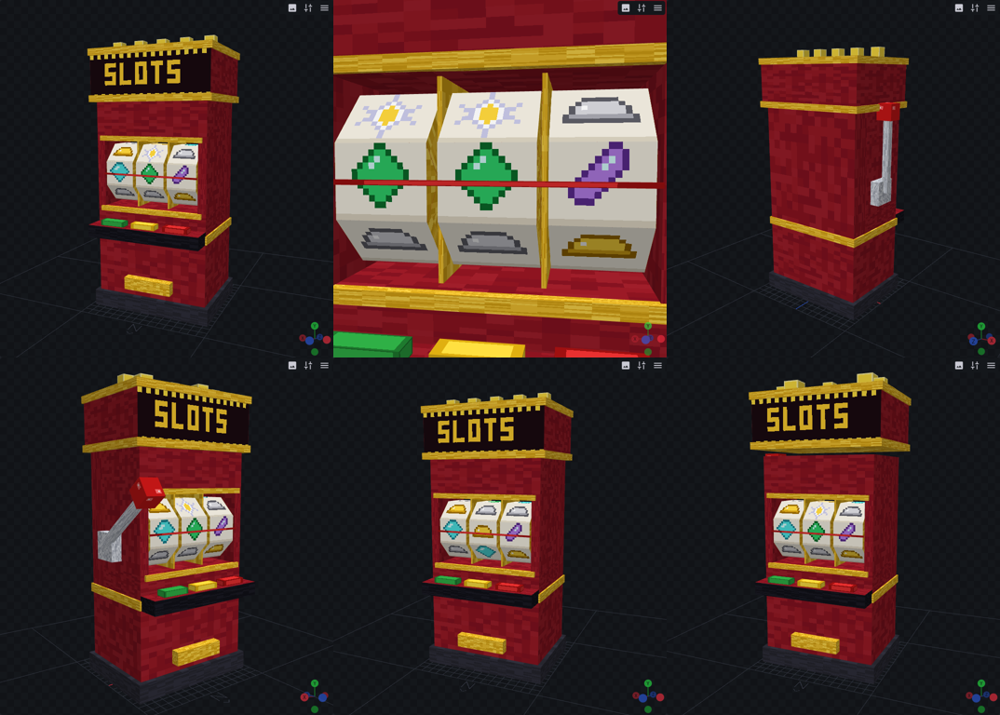

## Máquina de slots en 3D (ModelEngine R4)

`slot_machine.bbmodel` (se abre y edita en Blockbench):

| Animación | Qué hace |
|---|---|
| `idle` | Luces titilando (en bucle) |
| `spin` | Baja la palanca y parpadean las luces |
| `reelR_K` | Rodillo R (1 = izquierda) gira y se queda con la cara K al frente. El plugin elige K para que paren **en los símbolos que tocaron** |
| `win` | Luces a tope y el cartel rebota |

Los símbolos son los ítems del módulo de slots (diamante, esmeralda, oro, hierro, amatista
y estrella del Nether). Si un tema usa otros ítems, la máquina muestra unos equivalentes
respetando parejas y tríos.

**Instalar**
1. Instala ModelEngine. Al arrancar, GamblingDex copia el modelo a
   `plugins/ModelEngine/blueprints/gamblingdex/` (si no estaba).
2. `/meg reload`. El modelo aparece encima de cada estación de slots (se puede clickear).
3. `/gdx station rotate` mirando la estación para girarla 90°.
   A quien ve el modelo se le esconden la mesa de encantamientos y el holograma (solo en su
   pantalla) y la máquina queda en el suelo (`slots.yml → model.hide_station`).
4. Opciones en `slots.yml → model` (altura, hitbox, radio del sonido, desactivar).

## Cajero de fichas en 3D (ModelEngine R4)

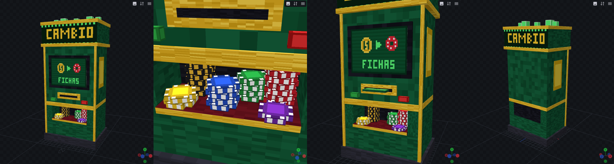

`exchange_machine.bbmodel`: mueble verde y dorado con cartel "CAMBIO", pantalla, ranura de
billetes y una bandeja con montones de fichas.

| Animación | Qué hace |
|---|---|
| `idle` | Bombillos del cartel titilando (en bucle) |
| `buy` | La pantalla destella y cae un montón de fichas a la bandeja |
| `sell` | Entra un billete por la ranura y la pantalla destella |

Se instala igual que la tragamonedas (se copia solo a `plugins/ModelEngine/blueprints/gamblingdex/`,
luego `/meg reload` y `/gdx pack`). Opciones en `config.yml → exchange.model`.
Con el pack, el menú de cambio también tiene fondo propio y suena una lluvia de fichas al
comprar y una caja registradora al vender.

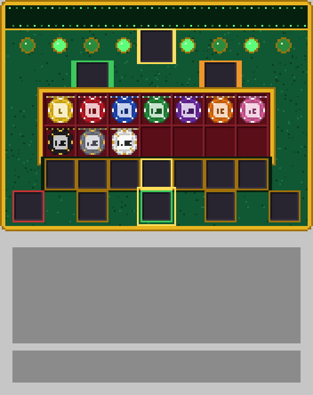

> **Todas las máquinas**: las animaciones y los sonidos salen del modelo, así que los ven y oyen
> todos los que estén cerca (no solo el que juega). Para añadir una máquina nueva basta con
> sumarla a `StationModels.Kind`.

## Mesa de ruleta en 3D (ModelEngine R4)

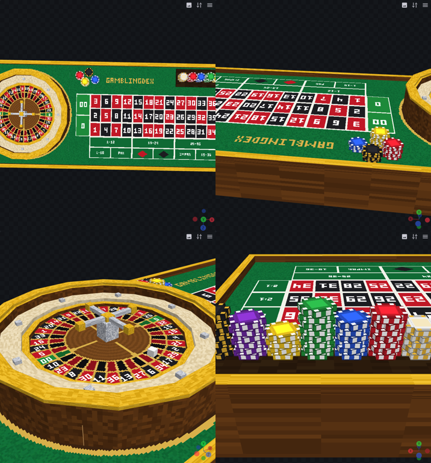

`roulette_table.bbmodel`: rueda americana (0 y 00) con plato giratorio, torreta, pista con
deflectores y la bola, más el paño con el tablero de apuestas (números, 0/00, docenas,
columnas "2:1", 1-18, par, rojo, negro, impar, 19-36) y fichas de decoración (bandeja del crupier).

| Animación | Qué hace |
|---|---|
| `idle` | El plato gira despacio (en bucle) |
| `ball_<N>` | La bola corre en contra del plato, frena, rebota y se queda en el número N (0..36 o 00). 7 s |

- La mesa se pone en el centro de cada ruleta. Quien ve la mesa 3D **no ve el anillo de bloques
  ni sus números** (se apuesta solo en la mesa; el mundo no se toca, así que con
  `hide_ring: false` o sin ModelEngine vuelve todo como siempre).
- La mesa es sólida (shulkers invisibles, `collision: true`).
- **Click en una casilla del paño** = elegirla (con fichas en la mano, apostar ahí; shift = todo
  el stack). Click en la rueda = lo mismo que el centro (menú de apuestas).
- **Las fichas apostadas se ven sobre el paño**, un montón por casilla, y se van al terminar la ronda.
- Al girar, la bola cae en el número que salió y entonces se paga.
- En el paño se iluminan **todas las casillas ganadoras** (número, color, par/impar, 1-18/19-36,
  docena y columna): parpadean unos segundos y quedan encendidas hasta el siguiente giro.

  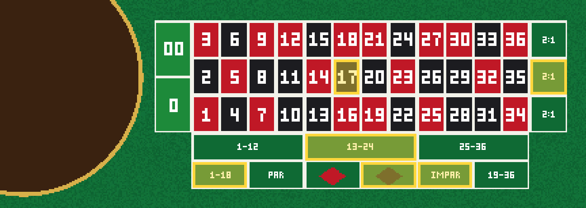
- Opciones en `ruleta.yml → model` (`scale: auto` o un número, `hide_station`, `hide_ring`, `collision`...).
- Menús de la ruleta con fondo propio (apuestas y la rueda de plenos):

  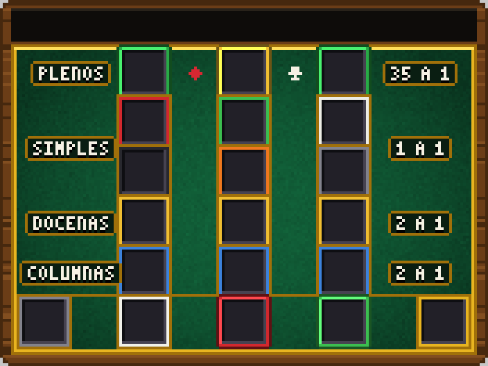

## Póker: mesa en 3D, cartas, fichas y botón del dealer

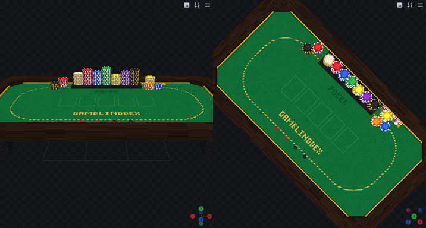
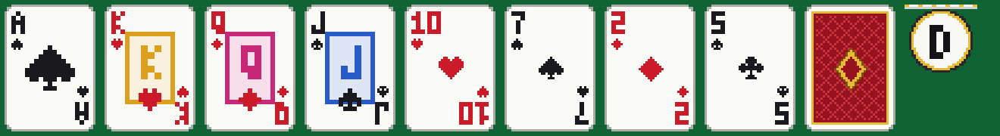

- `poker_table.bbmodel` (ModelEngine): mesa rectangular con paño, borde acolchado, esquinas
  achaflanadas, los huecos de las 5 cartas y la bandeja del dealer con fichas. Se ajusta sola
  para que el borde quede justo delante de los asientos (`poker.yml → model.scale`).
- **Cartas y fichas en 3D** (resource pack, `resource_pack.custom_cards: true`; funcionan
  también sin ModelEngine, sobre la mesa de bloques): baraja completa de 52 cartas + dorso.
  - Cada carta sale de la bandeja del dealer y se desliza a su sitio.
  - Flop, turn y river llegan boca abajo y **se dan vuelta** en el centro.
  - Tus 2 cartas quedan delante de tu asiento: **tú las ves boca arriba, los demás el dorso**;
    en el showdown se voltean para todos.
  - Las apuestas se deslizan desde cada asiento, el bote queda junto a las cartas y el botón
    del dealer va delante de quien lo tiene.
  - Al terminar la mano, **las fichas del bote se deslizan hasta el ganador** (si son varios,
    se reparten entre ellos).
  - Sonidos para los que están cerca: carta repartida, carta que se da vuelta, fichas y bote
    al ganador.

## Blackjack: mesa en 3D, cartas y fichas

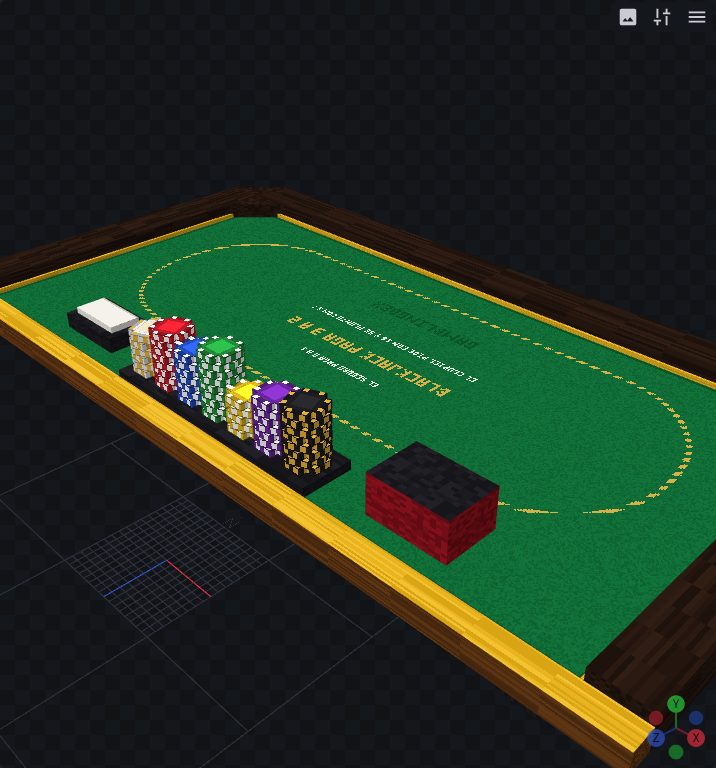

- `blackjack_table.bbmodel` (ModelEngine): mesa rectangular (como la de póker) delante del
  dealer con "BLACKJACK PAGA 3 A 2", las reglas del crupier, bandeja de fichas, zapato de cartas
  y descartes. Mira hacia donde mira el dealer (`/gdx station rotate` gira a los dos) y se ajusta
  a los asientos (a tamaño completo, a unos 3-4 bloques del dealer). Opciones en `blackjack.yml → model`.
- **Cartas y fichas en 3D** (`resource_pack.custom_cards: true`; también sin ModelEngine):
  - Las cartas salen del zapato y quedan en escalera en el borde de la mesa delante de cada
    jugador; las manos
    divididas, una al lado de la otra.
  - La segunda carta del dealer queda boca abajo y **se da vuelta** cuando le toca jugar.
  - La apuesta va delante de cada jugador (las laterales al lado). Si ganas, el pago sale de la bandeja
    del dealer y **todo se desliza hacia ti**; si pierdes, **el dealer se lleva las fichas**.
  - Sonidos de cartas, volteo, fichas y premio para los que están cerca.

## Menús de póker y blackjack con fondo propio

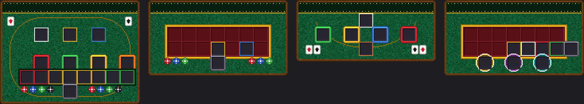

Con `resource_pack.custom_gui: true`: acciones del póker (retirarse rojo, pasar/igualar verde,
subir dorado, ALL-IN naranja y la tira para ajustar la subida), comprar fichas del póker,
acciones del blackjack (pedir, doblar, dividir, plantarse) y apuestas del blackjack (vitrina de
fichas y los tres círculos: principal, parejas y 21+3).

## Sillas (taburetes de casino)

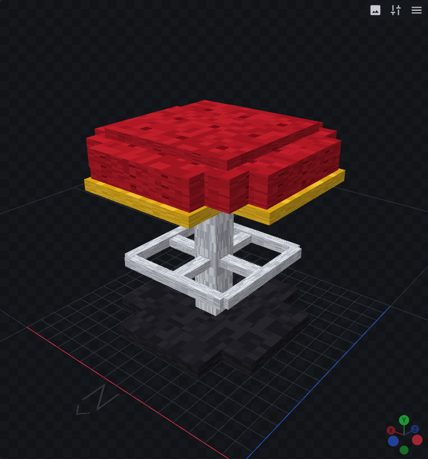

Con `resource_pack.custom_chairs: true` sale un taburete (asiento rojo acolchado, borde dorado,
pata cromada) en cada asiento de las mesas de póker y blackjack, mirando hacia la mesa.
**Click derecho = sentarse**, shift = pararse. Estar sentado cuenta como estar en ese asiento.
Opciones en `config.yml → chairs` (`scale`, `sit_height`).

## Fichas en 3D (resource pack)

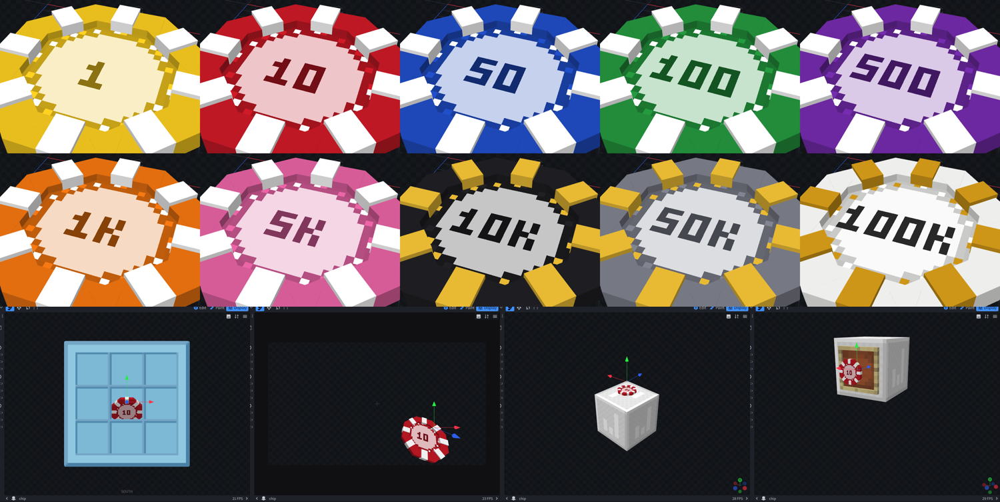

Cada ficha (amarilla 1, roja 10, azul 50, verde 100, morada 500, naranja 1.000, rosa 5.000,
negra 10.000, gris 50.000, blanca 100.000) es una ficha de casino fina, con el aro más alto que
el centro (hundido, con el valor impreso) y 8 marcas en relieve. Acostada en el suelo, en la mano
y en el inventario, y de frente en los marcos. Las de 10.000 o más llevan marcas doradas.

Se activa con `resource_pack.custom_chips: true` (usa `custom_model_data` 7701 sobre los tintes;
si ya tienes tu propio modelo en `currency.token.custom-model-data`, se respeta el tuyo).
Las fichas que ya tengan los jugadores se actualizan al entrar o con `/gdx reload`.
Modelo editable: `chip.bbmodel` (Blockbench, formato Java Block/Item).

## Menú con fondo propio y sonidos (resource pack)

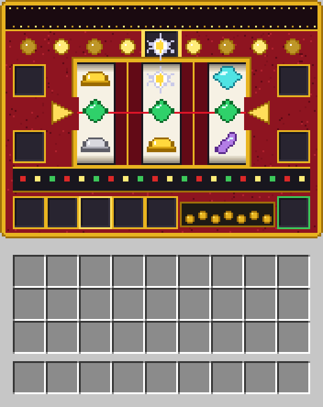

*(vista previa: en el juego los ítems se ven con su textura normal de Minecraft)*

Sonidos nuevos: palanca, tic de rodillos, parada de rodillo, premio, jackpot, sin premio y monedas.
Los que están cerca de la máquina también la oyen.

1. `/gdx pack` → crea `plugins/GamblingDex/GamblingDex-pack.zip` y, si encuentra el pack de
   ModelEngine, `GamblingDex-merged.zip` (los dos juntos: **sube ese**).
2. Sube el zip a una web con enlace directo (p. ej. mc-packs.net) y pon la URL y el SHA-1 en
   `config.yml → resource_pack.send` (o en `server.properties`).
3. Activa `resource_pack.custom_gui` y `resource_pack.custom_sounds`.

> Quien no tenga el pack no ve el modelo 3D y vería cuadros en el título del menú, por eso
> conviene `resource_pack.send.required: true`. Con `custom_gui`/`custom_sounds` en `false`
> todo se ve como siempre.

## Regenerar

```bash
# Pack (fondo del menú, sonidos .ogg, pack.mcmeta) -> src/main/resources/pack/
python3 models/tools/build_pack.py        # requiere numpy, Pillow y ffmpeg con libvorbis
cd models && node tools/render_chips.mjs previews/chips   # capturas + chip.bbmodel

# Modelo: corre models/tools/slot_machine.js dentro de Blockbench (compilado desde su código)
git clone --depth 1 https://github.com/JannisX11/blockbench.git && cd blockbench
npm install --ignore-scripts && npm run build-web && python3 -m http.server 8765 &
cd models && VIEWS='[["front",[-22,24,-50]]]' node tools/render.mjs tools/slot_machine.js slot_machine.bbmodel previews/
VIEWS='[["front",[-22,24,-50]]]' node tools/render.mjs tools/exchange_machine.js exchange_machine.bbmodel previews/
VIEWS='[["top",[46,170,0.5],[46,0,0]]]' node tools/render.mjs tools/roulette_table.js roulette_table.bbmodel previews/
VIEWS='[["angle",[0,60,110],[0,8,0]]]' node tools/render.mjs tools/poker_table.js poker_table.bbmodel previews/
VIEWS='[["players",[0,55,-95],[0,8,-24]]]' node tools/render.mjs tools/blackjack_table.js blackjack_table.bbmodel previews/
cp slot_machine.bbmodel exchange_machine.bbmodel roulette_table.bbmodel poker_table.bbmodel blackjack_table.bbmodel ../src/main/resources/models/
```

Si cambias el orden de los símbolos en `slot_machine.js`, cambia también `ORDER` en
`StationModels.java`.

## Colisión y clicks

- Las máquinas (2 bloques de alto), las mesas y las sillas son **sólidas**: shulkers invisibles,
  quietos e invulnerables, uno por bloque (`collision: true` en cada `model` y en `chairs`). No
  ocupan los asientos ni el sitio del dealer, y si cambias los asientos con los comandos se
  recolocan solos. En mundos en pacífico no se ponen.
- Los clicks en los modelos, las mesas y las sillas funcionan aunque WorldGuard o la protección
  del spawn bloqueen interactuar con entidades (antes solo podían usarlos los admins).
